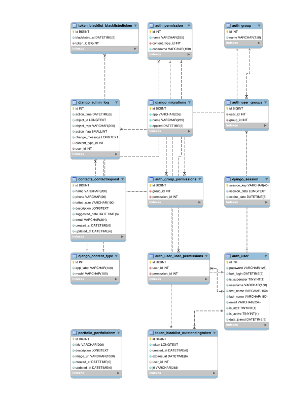

## Architetura

### System Design

Desenho inicial de comunicação entre aplicações.

  

### Implantação na AWS

Topologia da infraestrutura em nuvem, produtos AWS utilizados, fronteiras de rede, pipeline de CI/CD e estimativa de custos.

➡️ [aws-deployment.md](aws-deployment.md)

### Diagrama ER

Considera não só as tabelas de Portfolio e Contato, mas também toda a arquitetura de autenticação e CRUDs.

  

