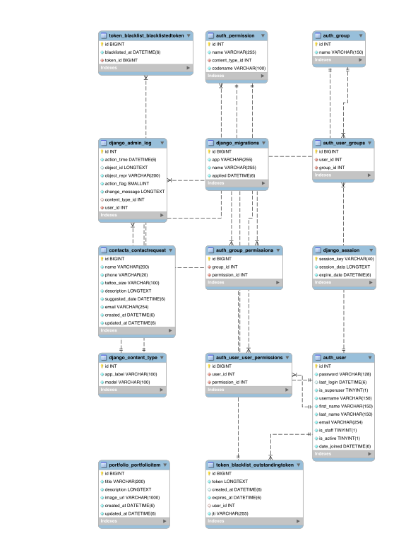

## Architetura

### System Design

Desenho inicial de comunicação entre aplicações.

  

### Implantação na Azure

Topologia da infraestrutura em nuvem, produtos Azure utilizados, fronteiras de rede, pipeline de CI/CD e estimativa de custos. Implantação atual do projeto.

➡️ [azure-deployment.md](azure-deployment.md)

### Implantação na AWS (anterior)

Desenho original, substituído pela implantação na Azure para caber no crédito de US$ 100 do Azure for Students. Mantido como referência histórica.

➡️ [aws-deployment.md](aws-deployment.md)

### Diagrama ER

Considera não só as tabelas de Portfolio e Contato, mas também toda a arquitetura de autenticação e CRUDs.

  

