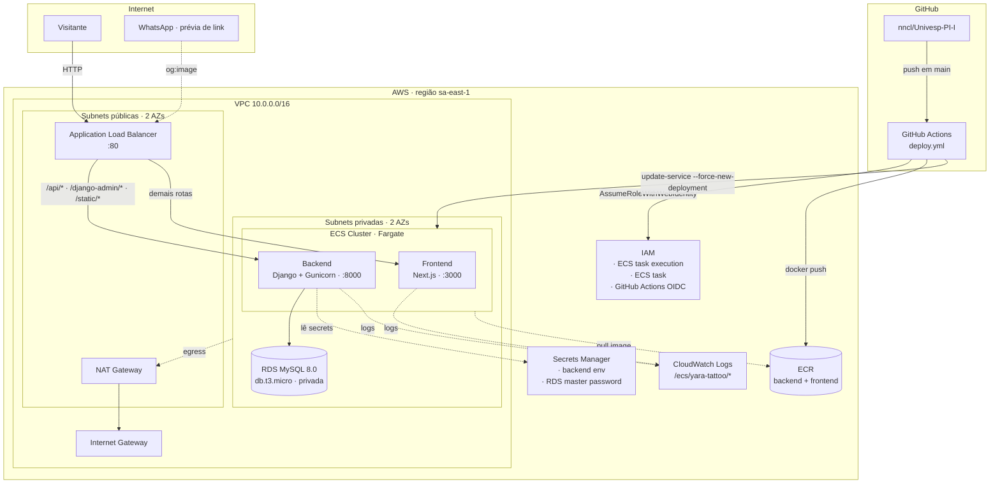
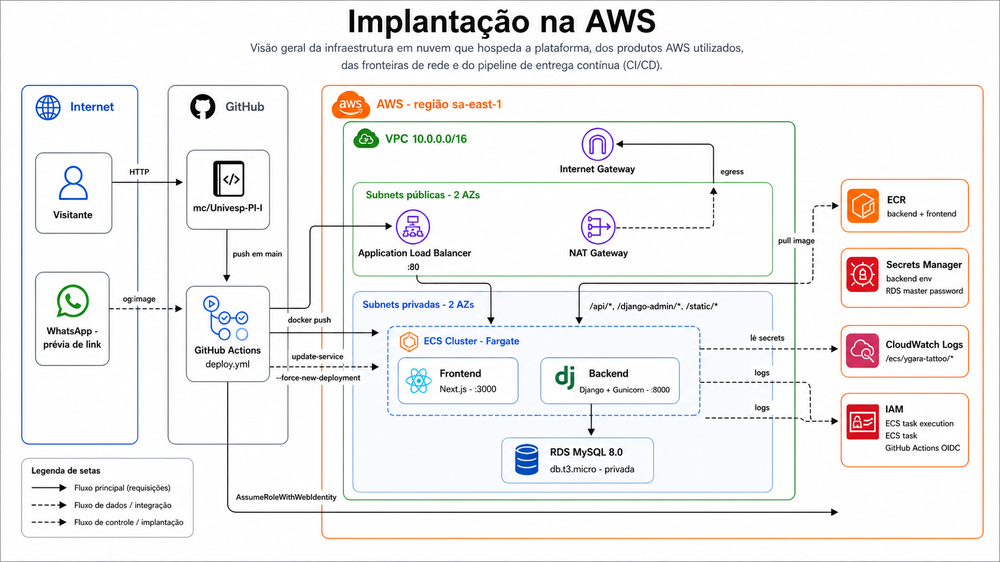

# Implantação na AWS

Visão geral da infraestrutura em nuvem que hospeda a plataforma, dos produtos AWS utilizados, das fronteiras de rede e do pipeline de entrega contínua (CI/CD).

## Diagrama





## Produtos e serviços AWS

| Serviço | Para quê | Configuração relevante |
| --- | --- | --- |
| **VPC** | Rede isolada onde toda a aplicação roda | CIDR `10.0.0.0/16`, 2 AZs (`sa-east-1a`, `sa-east-1b`), subnets públicas e privadas separadas |
| **Internet Gateway** | Permite tráfego de entrada nas subnets públicas | Ligado às rotas da subnet pública |
| **NAT Gateway** | Saída para internet das subnets privadas (ECS puxar imagens, contatar Secrets Manager etc.) | **Único** NAT (em vez de um por AZ) por economia — ~US$ 32/mês |
| **Application Load Balancer** | Ponto de entrada HTTP público; faz roteamento por caminho | Listener `:80`, regra que envia `/api/*`, `/django-admin/*`, `/static/*` ao backend e o restante ao frontend |
| **ECS (Fargate)** | Orquestra os contêineres da aplicação sem gerenciar servidores | 1 cluster (`yara-tattoo-cluster`), 2 services (`backend`, `frontend`), tasks com 0,25 vCPU + 512 MB |
| **ECR** | Registro privado de imagens Docker | 2 repositórios (`yara-tattoo-backend`, `yara-tattoo-frontend`) com lifecycle policy básica |
| **RDS MySQL** | Banco relacional para portfólio, contatos e usuários do Django | `db.t3.micro`, 20 GB gp3, **não público**, em subnets privadas, senha master gerenciada pelo Secrets Manager |
| **Secrets Manager** | Armazena segredos da aplicação fora do código | Dois segredos: `yara-tattoo/prod/backend` (Django) e o gerenciado pelo RDS |
| **CloudWatch Logs** | Coleta stdout/stderr dos contêineres | Log groups `/ecs/yara-tattoo/backend` e `/ecs/yara-tattoo/frontend`, retenção de 30 dias |
| **IAM** | Permissões mínimas para ECS e GitHub Actions | 3 roles distintas; OIDC provider para GitHub sem chaves de longa duração |

## Topologia de rede

| Camada | Recursos | Acesso |
| --- | --- | --- |
| **Pública** (10.0.0.0/24, 10.0.1.0/24) | ALB, NAT Gateway | Recebe tráfego da internet pelo IGW |
| **Privada** (10.0.10.0/24, 10.0.11.0/24) | ECS tasks, RDS | Sem IP público; saída para internet apenas pelo NAT |

### Security groups

```
ALB SG          ingress  :80   ← 0.0.0.0/0
ECS tasks SG    ingress  :3000 ← ALB SG
                ingress  :8000 ← ALB SG
RDS SG          ingress  :3306 ← ECS tasks SG
```

A regra-chave: o RDS **só aceita conexões dos contêineres ECS**, nunca do laptop do desenvolvedor. Para inspecionar o banco usa-se o Django Admin (`/django-admin/`), o ECS Exec ou um bastion via SSM.

## Imagens e deploy contínuo

```
push main → GitHub Actions
           ├─ job test:        Django check + tests (MySQL temporário em service container)
           ├─ job deploy-back: docker build → push ECR → ecs update-service backend
           └─ job deploy-front: docker build com NEXT_PUBLIC_API_BASE_URL → push ECR → ecs update-service frontend
```

- **Autenticação**: GitHub Actions assume a role `yara-tattoo-github-actions` via OIDC — a relação de confiança limita o uso a `repo:nncl/Univesp-PI-I:ref:refs/heads/main`. Não há `AWS_ACCESS_KEY_ID` armazenado no GitHub.
- **Permissões da role**: `ecr:*` apenas nos dois repositórios e `ecs:UpdateService`/`DescribeServices` apenas nos dois services. Nada além disso (nem IAM, nem Terraform).
- **Estratégia de deploy**: `--force-new-deployment` sobre a task definition existente. ECS sobe novas tasks com a tag `:latest` recém-publicada, espera ficarem saudáveis no target group, e mata as antigas (`min healthy 0%`, `max 200%`).

## Variáveis de ambiente e segredos

| Origem | Como chega no contêiner |
| --- | --- |
| `terraform/ecs.tf` (`environment`) | Valores não-sensíveis injetados na task definition: `DJANGO_DEBUG`, `DJANGO_ALLOWED_HOSTS`, `CORS_ALLOWED_ORIGINS`, `DATABASE_HOST/PORT/NAME/USER`, `DJANGO_ADMIN_EMAIL`, `NEXT_PUBLIC_API_BASE_URL`, `INTERNAL_API_BASE_URL` |
| `terraform/ecs.tf` (`secrets`) | Resolvidos pela ECS task execution role no momento de iniciar o contêiner: `DJANGO_SECRET_KEY`, `DJANGO_ADMIN_USERNAME`, `DJANGO_ADMIN_PASSWORD` (de `yara-tattoo/prod/backend`) e `DATABASE_PASSWORD` (do segredo gerenciado pelo RDS) |
| GitHub Actions repo variables | `AWS_DEPLOY_ROLE_ARN`, `NEXT_PUBLIC_API_BASE_URL` (este último é build-arg, vai pro bundle do Next.js) |

> ⚠️ `NEXT_PUBLIC_*` é **inlined em build-time** pelo Next.js. Defini-lo só na task definition não tem efeito no bundle do navegador — daí ele ser passado como `--build-arg` no workflow.

## Custo aproximado mensal (sa-east-1)

| Item | US$/mês |
| --- | --- |
| NAT Gateway (1×) | ~32,00 |
| Application Load Balancer | ~22,00 |
| ECS Fargate (2 tasks · 0,25 vCPU · 512 MB · 24/7) | ~10,00 |
| RDS MySQL `db.t3.micro` + 20 GB gp3 | ~16,00 |
| ECR storage + transferência | ~1,00 |
| CloudWatch Logs | ~1,00 |
| Secrets Manager (2 segredos) | ~0,80 |
| **Total estimado** | **~83,00** |

O NAT Gateway e o ALB respondem por mais da metade do custo. Para um projeto acadêmico é prudente rodar `terraform destroy` entre apresentações.

## Observações

- **Sem TLS**: o ALB fala HTTP puro. Habilitar HTTPS exige um certificado no ACM e um listener `:443` — fora do escopo do MVP, mas é trivial de adicionar.
- **Sem domínio próprio**: a aplicação é acessada pelo DNS do ALB. Trocar por um domínio passa por Route 53 (ou outro DNS) apontando para o ALB.
- **Single-AZ no RDS**: `multi_az = false` por custo. Falha de AZ derruba o banco; aceitável para escopo acadêmico.
- **State do Terraform local**: o `terraform.tfstate` vive na máquina do desenvolvedor. Para colaboração, mover para um backend S3 + DynamoDB lock seria o próximo passo.

## Para apresentação

O diagrama Mermaid pode ser exportado como SVG/PNG colando o bloco em <https://mermaid.live>. O resultado mantém a mesma estrutura, pronto para slides.
