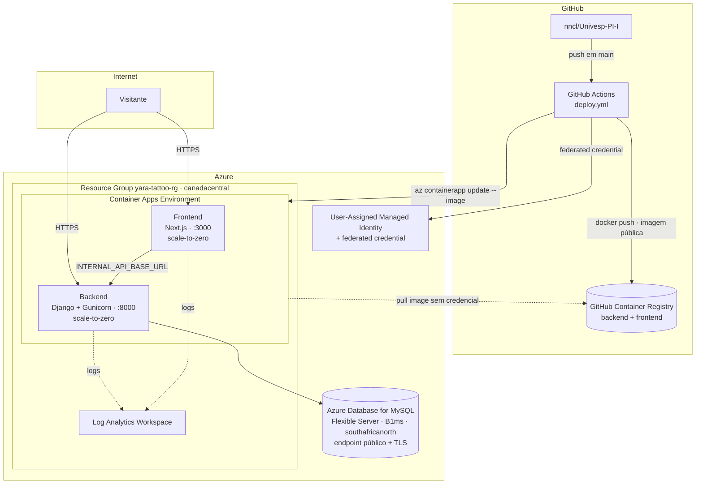

# Implantação na Azure

Visão geral da infraestrutura em nuvem que hospeda a plataforma, dos produtos Azure utilizados, das fronteiras de rede e do pipeline de entrega contínua (CI/CD).

> Esta implantação substitui a [implantação anterior na AWS](aws-deployment.md), migrada para caber no crédito de US$ 100 do Azure for Students.

> ⚠️ **Assinaturas novas (student inclusive) vêm com uma lista restrita de regiões.** Tentar criar qualquer recurso cobrável fora dela falha com `RequestDisallowedByAzure`, mesmo em regiões populares (East US, West Europe etc.) — só recursos "grátis" como Resource Group passam. A lista de regiões liberadas fica em **Subscriptions > [sua assinatura] > Settings > Policies** no portal. Foi assim que chegamos em `canadacentral` como região deste projeto, em vez de `brazilsouth`. O MySQL Flexible Server ficou em `southafricanorth` à parte — a capacidade do SKU `B_Standard_B1ms` não estava disponível em `canadacentral` para esta assinatura (`ProvisionNotSupportedForRegion`); confira com `az mysql flexible-server list-skus -l <região>` antes de trocar.
>
> ⚠️ **Entra ID App Registration bloqueada para usuários do tenant acadêmico.** Criar uma App Registration (necessária para o padrão usual de OIDC do GitHub Actions) falhou com `Authorization_RequestDenied: Insufficient privileges` — tenants institucionais costumam desabilitar esse self-service para usuários comuns. A alternativa que funciona com as permissões padrão de um Resource Group é uma **User-Assigned Managed Identity** (`azurerm_user_assigned_identity` + `azurerm_federated_identity_credential`), que suporta a mesma federação OIDC do GitHub sem precisar de permissão nenhuma no Entra ID.
>
> ⚠️ **Bug confirmado do Container Apps: o campo `registries` não persiste.** Configurar credencial de registry privado (`registry` block no Terraform, `az containerapp registry set` na CLI, e até um `PATCH` cru na API do ARM) nunca gravou o campo `properties.configuration.registries` neste ambiente — confirmado de 4 formas independentes, minutos depois, sem ser uma questão de propagação. A solução foi tornar as imagens do GHCR **públicas**: sem credencial nenhuma, o Container Apps simplesmente puxa a imagem, e o bug fica irrelevante.

## Diagrama



## Produtos e serviços Azure

| Serviço | Para quê | Configuração relevante |
| --- | --- | --- |
| **Resource Group** | Agrupa todos os recursos do projeto | `yara-tattoo-rg`, região `canadacentral` |
| **Container Apps Environment** | Runtime serverless para os contêineres, com ingress HTTPS embutido | Sem VNet — dispensa o equivalente a um NAT Gateway/Load Balancer dedicado |
| **Container Apps** (2×) | Executa `backend` e `frontend` | `min_replicas = 0` (escala a zero quando ocioso — sem custo de computação parado), 0.25 vCPU / 0.5 GiB cada |
| **Azure Database for MySQL Flexible Server** | Banco relacional para portfólio, contatos e usuários do Django | SKU `B_Standard_B1ms` (Burstable), 20 GB, TLS obrigatório (`require_secure_transport = ON`), região `southafricanorth` (à parte do resto, ver nota acima) |
| **Log Analytics Workspace** | Coleta stdout/stderr dos contêineres | Retenção de 30 dias |
| **User-Assigned Managed Identity** | Identidade que o GitHub Actions assume via OIDC | Federated credential restrita a `repo:nncl/Univesp-PI-I:ref:refs/heads/main`; role `Container Apps Contributor` escopada ao resource group |
| **GitHub Container Registry (ghcr.io)** | Registro de imagens Docker, **públicas** | Fora da Azure — evita o custo do Azure Container Registry (~US$ 5/mês) e o bug do campo `registries` (ver nota acima) |

## Por que não uma VNet + Load Balancer, como na AWS?

O desenho AWS isolava tudo em uma VPC privada (RDS e ECS sem IP público, saída via NAT Gateway, entrada via ALB). Reproduzir isso na Azure — VNet + Application Gateway + Flexible Server com acesso privado — teria custo mensal parecido com o da AWS (~US$ 80+), inviável para US$ 100 de crédito total.

Trade-offs aceitos para caber no crédito, aceitáveis para escopo acadêmico:

- **Sem VNet**: cada Container App recebe seu próprio FQDN público (`https://yara-tattoo-backend.<env>.canadacentral.azurecontainerapps.io`), em vez de um único Load Balancer roteando por caminho (`/api/*` vs. resto). Frontend chama o backend pela URL pública dele.
- **MySQL com endpoint público**: em vez de ficar em subnet privada, o Flexible Server aceita conexões de "serviços Azure" (regra de firewall `0.0.0.0`) mais, opcionalmente, do IP do desenvolvedor (`my_ip_address`). Compensado com TLS obrigatório (`ssl_mode=REQUIRED` no Django) e senha forte gerada automaticamente.
- **Scale-to-zero**: os Container Apps dormem sem tráfego (`min_replicas = 0`), então não há custo de computação ocioso — mas a primeira requisição depois de um período parado sofre um cold start de alguns segundos.

## Imagens e deploy contínuo

```
push main → GitHub Actions
           ├─ job test:            Django check + tests (MySQL temporário em service container)
           ├─ job deploy-backend:  docker build → push GHCR → az containerapp update (backend)
           └─ job deploy-frontend: docker build com NEXT_PUBLIC_API_BASE_URL → push GHCR → az containerapp update (frontend)
```

- **Autenticação com a Azure**: GitHub Actions assume a User-Assigned Managed Identity `yara-tattoo-github-actions` via OIDC (federated credential) — sem `client secret` nem chave armazenada no GitHub.
- **Autenticação com o GHCR**: usa o `GITHUB_TOKEN` automático do workflow (`packages: write`) para publicar. Puxar a imagem não precisa de credencial nenhuma — os pacotes são públicos (ver nota no topo do documento sobre o bug do campo `registries`). **Passo manual único**: depois do primeiro `push` para `main`, marcar os dois pacotes (`yara-tattoo-backend`, `yara-tattoo-frontend`) como públicos em GitHub (Profile/Org > Packages > pacote > Package settings > Change visibility).
- **Permissões da identidade Azure**: role `Container Apps Contributor` apenas no resource group — não alcança banco de dados, IAM ou Terraform.
- **Estratégia de deploy**: `az containerapp update --image ...:<sha>` cria uma nova revisão, que assume 100% do tráfego assim que fica saudável (revision mode `Single`).

> ⚠️ `NEXT_PUBLIC_*` é **inlined em build-time** pelo Next.js — por isso `NEXT_PUBLIC_API_BASE_URL` vem de uma variável do repositório GitHub (definida manualmente com a saída `terraform output backend_url`), passada como `--build-arg`, e não como env var do Container App.

## Variáveis de ambiente e segredos

| Origem | Como chega no contêiner |
| --- | --- |
| `terraform/container_apps.tf` (`env` sem `secret_name`) | Valores não sensíveis: `DJANGO_DEBUG`, `DJANGO_ALLOWED_HOSTS`, `CORS_ALLOWED_ORIGINS`, `DATABASE_HOST/PORT/NAME/USER`, `DATABASE_SSL_REQUIRED`, `DJANGO_ADMIN_EMAIL`, `INTERNAL_API_BASE_URL` |
| `terraform/container_apps.tf` (`secret` + `env` com `secret_name`) | `DJANGO_SECRET_KEY` (gerado), `DJANGO_ADMIN_USERNAME`/`PASSWORD` (de `terraform.tfvars`), `DATABASE_PASSWORD` (gerado) |
| GitHub Actions repo variables | `AZURE_CLIENT_ID`, `AZURE_TENANT_ID`, `AZURE_SUBSCRIPTION_ID`, `NEXT_PUBLIC_API_BASE_URL`, `NEXT_PUBLIC_GA_MEASUREMENT_ID` |

## Custo aproximado mensal (canadacentral)

| Item | US$/mês |
| --- | --- |
| Container Apps (2 apps · 0,25 vCPU · 0,5 GiB · scale-to-zero) | ~0–3,00 (coberto em boa parte pelo free grant mensal) |
| Azure Database for MySQL Flexible Server `B_Standard_B1ms` + 20 GB | ~13,00 |
| Log Analytics (ingestão baixa) | ~0–2,00 |
| GitHub Container Registry | 0,00 |
| **Total estimado (rodando 24/7)** | **~15,00–18,00** |

Isso dá margem para **5–6 meses** de crédito rodando continuamente — ou o ano inteiro do curso se o Flexible Server for **parado** (`az mysql flexible-server stop`, até 7 dias por vez) entre sessões de trabalho e demos.

## TBD/TODO

- **Sem domínio próprio**: a aplicação é acessada pelos FQDNs `*.azurecontainerapps.io`. Um domínio customizado pode ser vinculado a cada Container App.
- **MySQL com acesso público**: ver seção "Por que não uma VNet" acima — o passo seguinte para produção real seria integrar o Container Apps Environment a uma VNet e usar acesso privado no Flexible Server.
- **Backend/frontend sem roteamento único**: sem um domínio + Front Door na frente dos dois Container Apps, cada um mantém sua própria URL pública.
